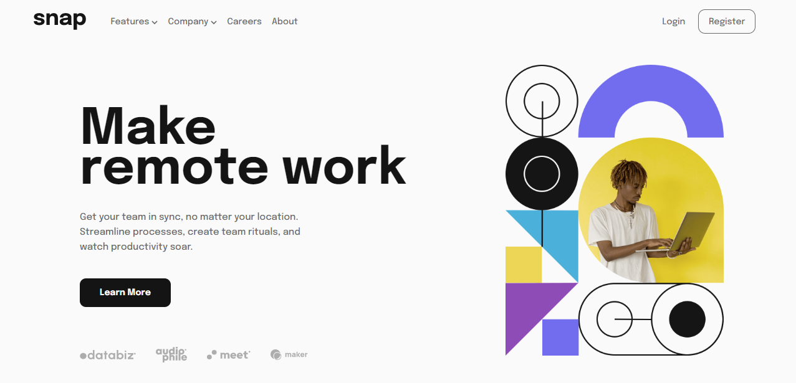
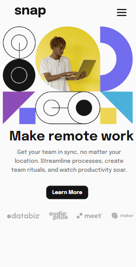
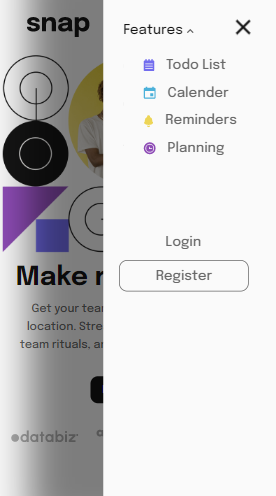

# Frontend Mentor - Intro section with dropdown navigation solution

This is a solution to the [Intro section with dropdown navigation challenge on Frontend Mentor](https://www.frontendmentor.io/challenges/intro-section-with-dropdown-navigation-ryaPetHE5). Frontend Mentor challenges help you improve your coding skills by building realistic projects. 

## Table of contents

- [Overview](#overview)
  - [The challenge](#the-challenge)
  - [Screenshot](#screenshot)
  - [Links](#links)
- [My process](#my-process)
  - [Built with](#built-with)
  - [What I learned](#what-i-learned)
  - [Continued development](#continued-development)
  - [Useful resources](#useful-resources)
- [Author](#author)
- [Acknowledgments](#acknowledgments)

## Overview

### The challenge

Users should be able to:

- View the optimal layout depending on their device's screen size

### Screenshot

### Links

- Live Site URL: [Frontend Mentor | Intro section with dropdown navigation](https://intro-dropdown-navigations.netlify.app/)

## My process

### Built with

- Semantic HTML5 markup
- CSS custom properties
- Flexbox
- JavaScript

### What I learned

1. Media Queries with CSS
2. Create Design Resonsiveness
3. Setting up the Mobilie menu
4. Making the mobile menu interactive

### Continued development
I will continue to build more complex project to enhance my tech stack.

### Useful resources

- [W3schools](https://www.w3schools.com) - This website helped me understand the basic use of padding and Media Queries
- [DEV](https://dev.to) - This webiste helped me to set up the mobile menu from zero to completion.
- [CSS-tricks](https://css-tricks.com) - This website helped me to use flexbox to set up my project. 

## Author

- Frontend Mentor - [@ellaboevans](https://www.frontendmentor.io/profile/ellaboevans)
- Twitter - [@theEvansElabo_](https://www.twitter.com/theevanselabo_)
- LinkedIn - [@evans-elabo](https://www.linkedin.com/in/evans-elabo)

## Acknowledgments

I am very grateful to have access to articles, stack overflow, and many more on the internet. I would like to thank each and everyone who has contributed to help us gain knowledge in whatever we do with the web.

